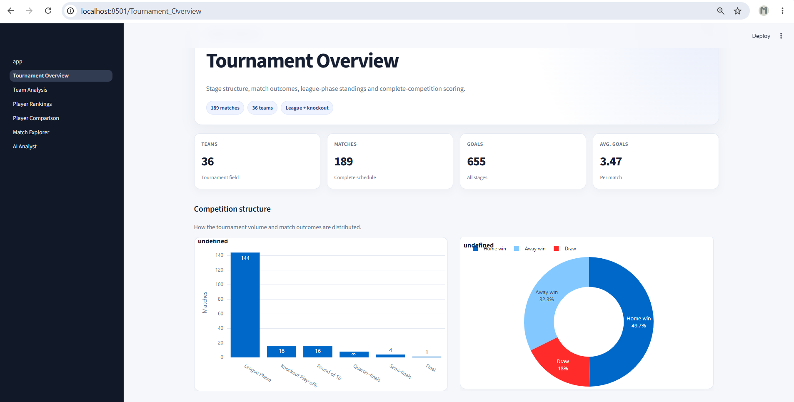
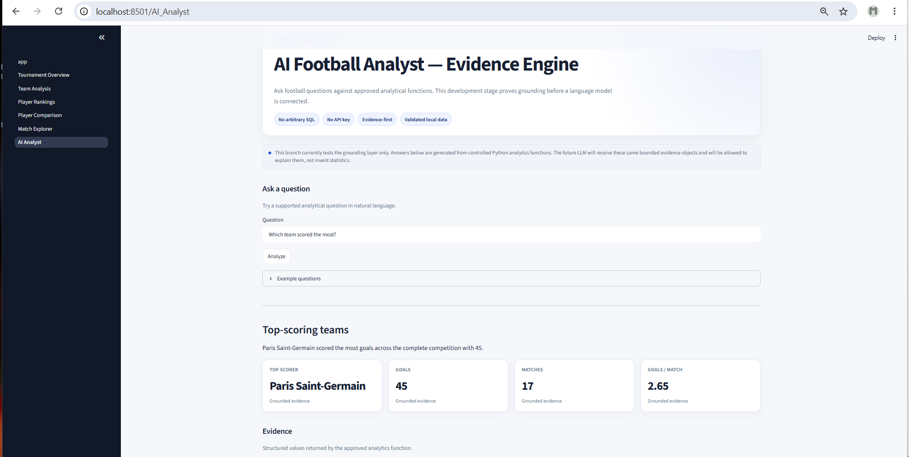

# UEFA Champions League 2025/26 Dashboard

Interactive Streamlit + Plotly application built on the separate
[`champions-league-2025-26-analytics`](https://github.com/Meeran16/champions-league-2025-26-analytics)
project.

The analytics repository remains the data-engineering and SQL layer. This repository focuses on interactive exploration, application design, and a grounded AI-assisted football analysis layer.

## Dashboard Preview

### Tournament Overview



### AI Analyst



## Quick start — open the dashboard

If the project is already set up, opening the dashboard is only two commands in PowerShell:

```powershell
cd D:\Github\champions-league-2025-26-dashboard
streamlit run app.py
```

Then open this address in the browser:

```text
http://localhost:8501
```

To stop the dashboard, return to PowerShell and press:

```text
Ctrl+C
```

If `streamlit` is not recognized, use:

```powershell
python -m streamlit run app.py
```

If the dashboard says that generated data is missing, run:

```powershell
python scripts/export_dashboard_data.py
python scripts/validate_dashboard_data.py
streamlit run app.py
```

That is normally all that is needed to reopen the project later.

## Dashboard pages

1. **Tournament Overview** — competition KPIs, stage breakdown, league table and scoring.
2. **Team Analysis** — club-level results, league-phase home/away performance, rolling form and detailed averages.
3. **Player Rankings** — Top-5 LPI rankings by position with source-signal breakdowns.
4. **Player Comparison** — same-position LPI comparison.
5. **Match Explorer** — tournament filters and match-level inspection.
6. **AI Analyst** — evidence-first natural-language football questions routed through approved analytical functions.

## Architecture

```text
champions-league-2025-26-analytics
        │
        │ completed SQLite database
        ▼
scripts/export_dashboard_data.py
        │
        ▼
data/derived/*.csv
        │
        ├──────────────► Streamlit + Plotly dashboard
        │
        └──────────────► Grounded AI evidence engine
                              │
                              ▼
                     future LLM explanation layer
```

The AI evidence engine does not execute arbitrary SQL. Questions are routed to approved analytical functions that return structured evidence, scope information, caveats, and relevant visualizations. Unsupported questions return safely without inventing statistics.

## First-time local setup

Recommended folder layout:

```text
D:\Github\
├── champions-league-2025-26-analytics\
└── champions-league-2025-26-dashboard\
```

### 1. Prepare the analytics database

From the analytics repository:

```powershell
cd D:\Github\champions-league-2025-26-analytics
python src/run_pipeline.py
python src/run_player_upgrade.py
python src/validate_data.py
python src/validate_player_data.py
```

### 2. Install dashboard dependencies

From the dashboard repository:

```powershell
cd D:\Github\champions-league-2025-26-dashboard
pip install -r requirements.txt
```

### 3. Export dashboard datasets

```powershell
python scripts/export_dashboard_data.py
```

The exporter automatically looks for:

```text
..\champions-league-2025-26-analytics\data\processed\champions_league.db
```

A custom database path can also be passed:

```powershell
python scripts/export_dashboard_data.py --db "D:\path\to\champions_league.db"
```

### 4. Validate the exported data

```powershell
python scripts/validate_dashboard_data.py
```

Expected core checks:

- 36 teams
- 189 matches
- 144 league-phase matches
- 36 league-table rows
- Forward, Midfielder, Defender and Goalkeeper LPI groups

### 5. Test the AI grounding layer

```powershell
python scripts/test_ai_backend.py
```

The current grounding test covers tournament, team, match, possession and player questions without using an LLM or arbitrary SQL.

### 6. Start the dashboard

```powershell
streamlit run app.py
```

Open:

```text
http://localhost:8501
```

## Data scope

- Complete tournament results: **189 matches**
- Detailed possession/shooting statistics: **144 league-phase matches**
- Player layer: reproducible **Leaderboard Performance Index (LPI)**
- Extra time and penalty shootouts: modelled separately

No missing knockout-stage possession or shooting values are inferred.

## Player-ranking limitation

The LPI is a project-defined analytical index, not an official UEFA award and not a complete event-data ranking of every tournament player.

It ranks players represented in the preserved source-leaderboard candidate pool. Different positions use different source signals and weights, so Player Comparison is restricted to the same position group.

## AI Analyst design

The current AI layer follows an evidence-first architecture:

```text
Natural-language question
        ↓
Entity resolution + intent routing
        ↓
Approved analytics function
        ↓
Validated dashboard data
        ↓
Structured evidence
        ↓
Answer + evidence + chart + scope + caveats
```

The next stage will add a language-model explanation layer on top of this structured evidence. Numerical claims will remain grounded in the analytical functions rather than being calculated or invented by the LLM.

## Data redistribution

Generated files under `data/derived/` are ignored by Git by default.

Before a public deployment, review the redistribution/licensing terms of the underlying detailed match-statistics sources and decide which generated datasets can be packaged with the deployed application.
